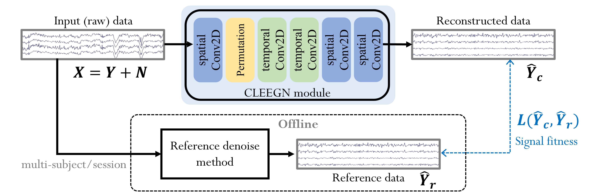

# torch-CLEEGN

This repository is the official PyTorch implementation of "CLEEGN: A Convolutional Neural Network for Plug-and-Play Automatic EEG Reconstruction".



## Instruction

### Environment Setup ###

```sh
conda create --name ENV_NAME python=3.7
conda activate ENV_NAME
nvidia-smi  # Get the CUDA Version
conda install pytorch torchvision torchaudio cudatoolkit=11.3 -c pytorch
pip install -r requirements.txt
```

#### Check GPU Support

```py
import torch
print(torch.cuda.is_available())
print(torch.cuda.device_count())
dev_id = torch.cuda.current_device()
print(torch.cuda.get_device_name(dev_id))
```

### Training Usage

```sh
$ python main.py configs/CONFIG_FILENAME.json
```

### Quick Inference

```sh
$ python inference.py --mat-path sample/ERN_S02_exSam.mat --model-path weights/weight-0.pth
```

## Results


## Real-time demo

[cemeteryparty/real_time_LSL_BCI](https://github.com/cemeteryparty/real_time_LSL_BCI) is the implementation of CLEEGN in a real-time system. The device in the video is an 8-channel EEG cap designed by Artise Biomedical Co., Ltd.

[demo video](https://www.youtube.com/watch?v=4aQiLA5xwBI)
